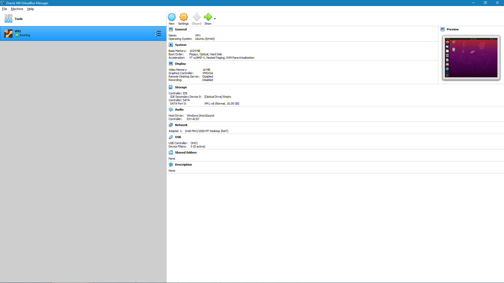
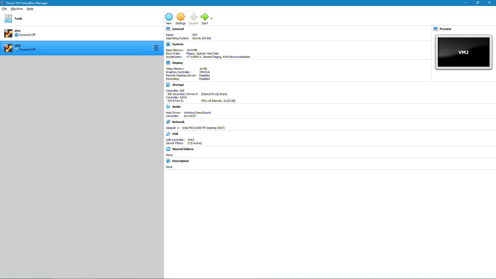

# DevOps_online_Kiev_2021Q4

TASK 2.1

PART 1. HYPERVISORS

1. VMware vSphere / ESXi

VMware vSphere Hypervisor is a free bare-metal hypervisor that virtualizes servers so you can consolidate your applications on less hardware.

VMware ESXi is a purpose-built bare-metal hypervisor that installs directly onto a physical server. With direct access to and control of underlying resources, ESXi is more efficient than hosted architectures and can effectively partition hardware to increase consolidation ratios and cut costs for customers.

2. Microsoft Hyper-V

Microsoft Hyper-V is a stand-alone product providing a simplified, reliable, cost-effective and optimized virtualization solution.

3. Citrix XenServer

Citrix Hypervisor is a virtualization management platform optimized for application, desktop and server virtualization infrastructures. Consolidation and containment of workloads on Citrix Hypervisor enables organizations of any vertical or size to transform their business IT compute infrastructures.

4. Red Hat Enterprise Virtualization (RHEV)

Red Hat Virtualization (formerly Red Hat Enterprise Virtualization) provides server and desktop virtualization tools

5.  KVM

KVM (for Kernel-based Virtual Machine) is an open-source virtualization solution for Linux on x86 hardware containing virtualization extensions (Intel VT or AMD-V).

PART 2. WORK WITH VIRTUALBOX

